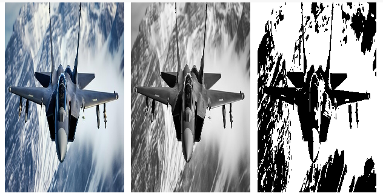

# Dimensionality-Reduction-in-Images-for-Neural-Networks-

# 🧠 Projeto Processamento de Imagens PPM

---

## 🏅 Badges

- 📦 Tamanho do repositório:  
  

- 📄 Licença do projeto:  
  

---

## 📋 Índice / Table of Contents

- [📖 Descrição](#-descrição)
- [🚧 Status](#-status)
- [⚙️ Funcionalidades](#️-funcionalidades)
- [🌐 Acesso](#-acesso)
- [🧰 Tecnologias](#-tecnologias)
- [👨‍💻 Desenvolvedor](#-desenvolvedor)
- [📜 Licença](#-licença)
- [🏁 Conclusão](#-conclusão)

---

## 📖 Descrição

Projeto educacional que realiza a leitura, conversão e visualização de imagens no formato **PPM (Portable Pixmap)**, sem uso de bibliotecas externas. Ideal para quem deseja entender como os pixels funcionam e como aplicar transformações como **escala de cinza** e **binarização** diretamente nos dados da imagem.

---

## 🚧 Status

✅ Projeto concluído e funcional!

---

## ⚙️ Funcionalidades

| 🔧 Função                  | 📌 Descrição                                 |
|---------------------------|----------------------------------------------|
| 📥 Leitura de imagens PPM | Suporte aos formatos P3 (texto) e P6 (binário) |
| 🎨 Conversão para cinza   | Aplicação da fórmula perceptual de luminância |
| ⚫⚪ Binarização            | Transformação em imagem preto e branco        |
| 💾 Salvamento em PPM      | Geração de arquivos `.ppm` no formato P3      |
| 🌐 Visualização em HTML   | Renderização das imagens diretamente no notebook |

---

## 🌐 Acesso

- [Repositório no GitHub](https://github.com/Rogerio5/ppm-image-processing)

---

## 🧰 Tecnologias

  
  
  

 

---

## 👨‍💻 Desenvolvedor

- [Rogerio](https://github.com/Rogerio5)

---

## 📜 Licença

Este projeto está sob a licença MIT. Consulte o arquivo `LICENSE` para mais detalhes.

---

## 🏁 Conclusão

Este projeto é uma excelente introdução à manipulação de imagens em baixo nível. Ao evitar bibliotecas externas, ele oferece uma compreensão clara de como os dados visuais são estruturados e transformados. Ideal para estudantes, curiosos e entusiastas de computação gráfica.
